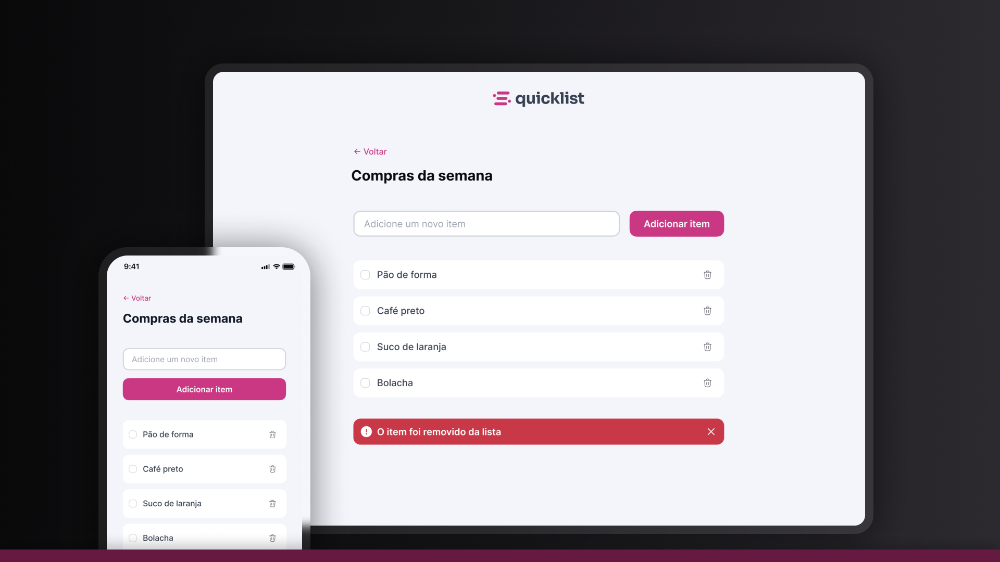

# 🛒 QuickList - Interactive Shopping List

A modern, responsive shopping list application built with vanilla HTML, CSS, and JavaScript. This project demonstrates fundamental web development concepts with a focus on clean code, accessibility, and user experience.

 


## 🌟 Features

- ✅ Add new items to your shopping list
- 🗑️ Remove items with a single click
- ☑️ Mark items as completed with custom checkboxes
- 📱 Fully responsive design for mobile and desktop
- ⚠️ Form validation with visual feedback
- 🔔 Removal confirmation alerts
- 🎨 Modern UI with smooth hover effects

## 🌐 Demo

Access the online version: [Shopping List Preview](https://maurodiogodev.github.io/shopping-list/)

## 📚 Key Concepts Applied

### CSS Concepts
- **CSS Custom Properties (Variables)** - Centralized color and typography system
- **CSS Imports** - Modular stylesheet organization
- **Flexbox Layout** - Responsive and flexible layouts
- **CSS Selectors** - Advanced selectors including `:has()`, `:focus-within`, `:hover`
- **Responsive Design** - Mobile-first approach with media queries
- **CSS Reset** - Normalized default browser styles
- **BEM-like Methodology** - Organized CSS class naming

### JavaScript Concepts
- **Event Handling** - Form submission, click events, and event delegation
- **DOM Manipulation** - Dynamic content creation and removal
- **Form Validation** - Client-side input validation
- **Template Literals** - Dynamic HTML generation
- **CSS Class Manipulation** - Toggle visibility and states
- **Event Delegation** - Efficient event handling for dynamic elements

### HTML Concepts
- **Semantic HTML** - Proper use of `<header>`, `<main>`, `<form>`, `<fieldset>`
- **Accessibility** - ARIA roles, proper labeling, and keyboard navigation
- **Form Elements** - Input validation and user feedback
- **SVG Integration** - Scalable icons and graphics

## 📁 Project Structure

```
quicklist/
├── assets/
│   ├── icons/          # SVG icons
│   └── logo.svg        # Application logo
├── styles/
│   ├── index.css       # Main stylesheet with imports
│   ├── global.css      # Global styles and CSS variables
│   ├── header.css      # Header component styles
│   └── main.css        # Main content styles
├── js/
│   └── script.js       # Application logic
└── index.html          # Main HTML file
```

## 🎨 Design Features

- **Color System** - Consistent color palette using CSS custom properties
- **Typography Scale** - Defined font sizes and weights for hierarchy
- **Interactive States** - Hover and focus states for better UX
- **Custom Checkboxes** - Styled checkbox components with SVG icons
- **Alert System** - Visual feedback for user actions
- **Mobile Responsive** - Optimized layout for different screen sizes


⭐ **If this project helped you in any way, consider giving the repository a star!**

Design UI/UX by [Rocketseat](https://www.rocketseat.com.br/)

---

<div align="center"> <p>Developed with ❤️ as part of my web development learning journey.</p> <p>Feel free to contribute or get in touch!</p> </div>
